# 吴恩达2022机器学习笔记

> 下面是吴佬的百宝袋

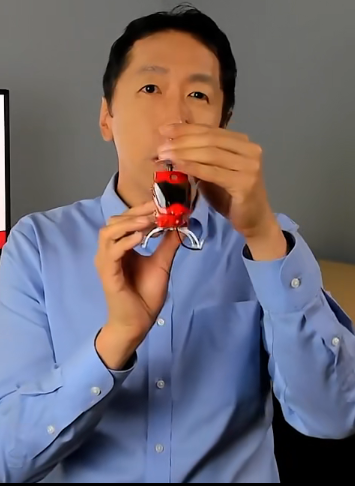

# WEEK 1

[TOC]

# 前言

吴佬星战迷（全视频出现了三次）


谷歌的搜索，邮件的过滤，都是机器学习。最想要的就是用机器模拟人的思维。

> 没有明确编码的机器解决问题的方法，让机器自己去学习Artifical General Inteligence New capability

- **人工手写代码**：数据挖掘，医学记录，工程
- **无法写代码**：自然语言处理，手写识别
- **推荐系统**：各种推广与学习

# 机器学习的定义

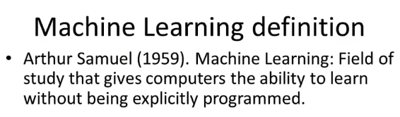

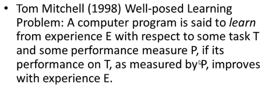

- **T**指机器所能帮助人解决的问题
- **P**指做到的程度（性能参数）
- **E**是指人们的输入实践

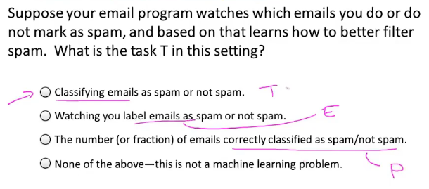

> 算法部分：监督学习与无监督学习 其他：推荐算法，信息检索

# 监督学习

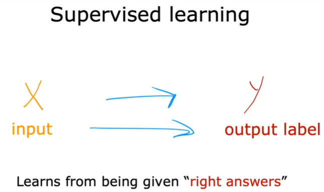

> 比如一个估值问题，用直线与曲线，给他我们的定义与数据，让机器去找到合适的解

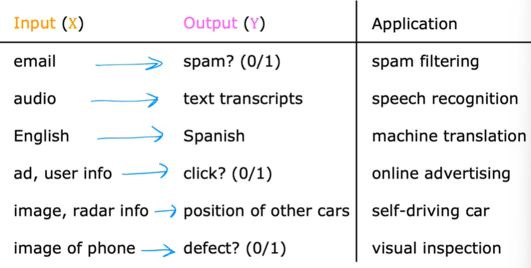

## 回归问题-regression problem


也叫做回归问题，用正确的数据推测预测的数据。从无限的数据中找到合适的那一个。

## 分类问题-classification problem

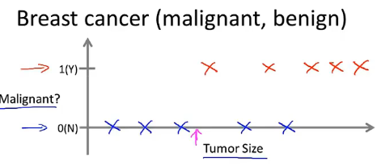

分类问题，**01分类**，还有更多种分类，不一定是具体数值，可能是判断是猫是狗还是。。。

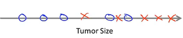

另一种表达方式

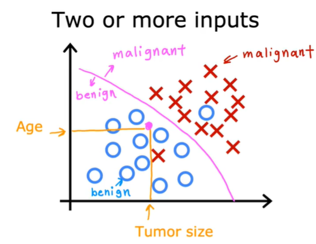

kmeans分类问题（maybe，多轴就要涉及到多个特征甚至无穷特征，计算机如何存储——**向量机**。 11/13/2022 20:26

# 无监督学习

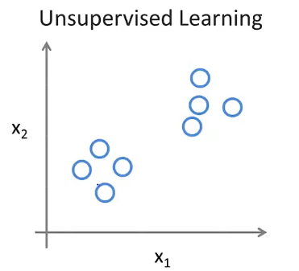

聚类-**Custering**，不再给出问题的具体分类信息，让机器自己去分类


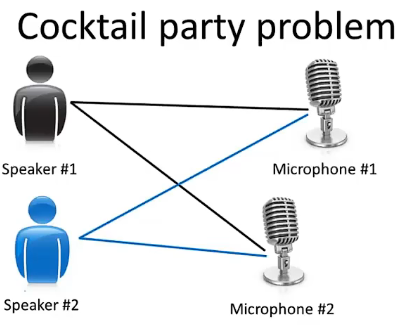

算法识别叠加声音，分离音频

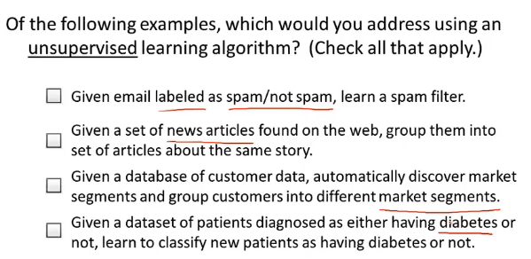

## 两者的区别

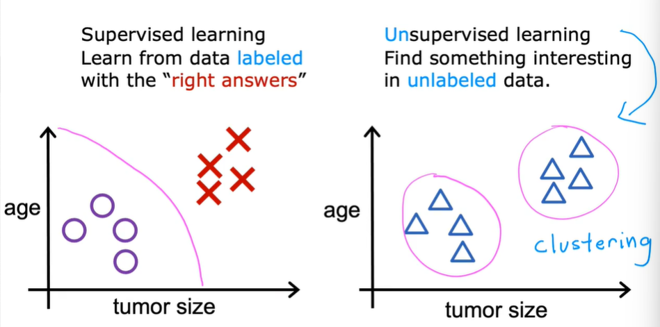

# 线性回归-linear regression

## 前言-线性回归的介绍

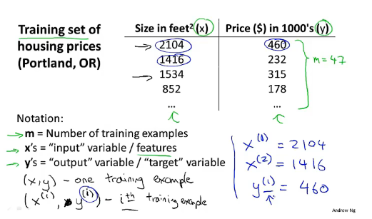

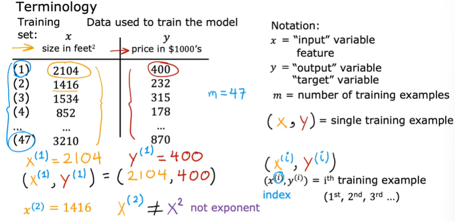

**hypothesis function-假设函数**

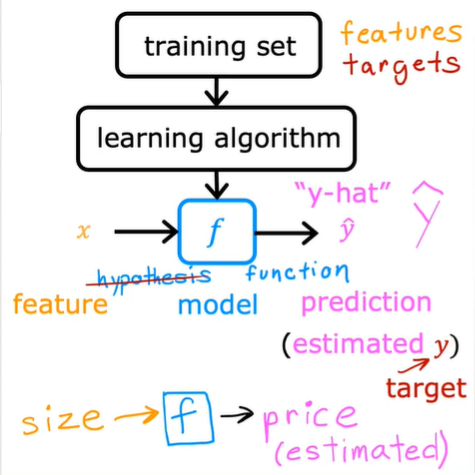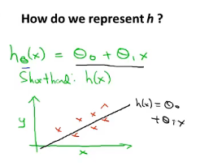

**linear regression-线性回归**(with one variable)下图为多种情况下的回归直线

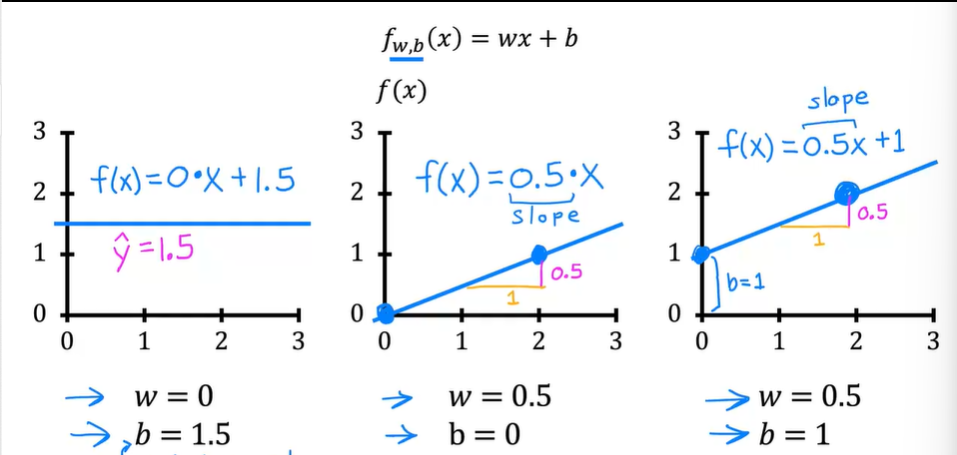

## Cost Function(代价函数)

> 注意，这个函数是指的残差平均值与代价函数参数的关系


univariate linear regression(单变量线性回归)
$$
h_{\theta}(x) = \theta_{0} + \theta_{1}x\\
 后面改版的\quad f_{w,b}(x) = wx+b
$$

线性回归目标(parameters-参数)
$$
min \frac{1}{2m}\sum_{i = 1}^m (f_{w,b}(x^{(i)}) - y^{(i)} )^2
$$

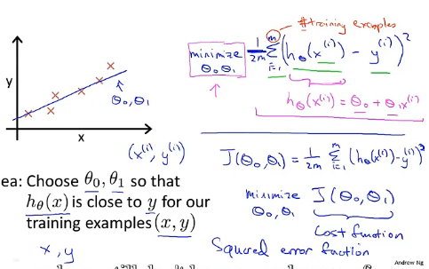

> 至于为什么要除以2m，可以把这个min函数视为一个二元函数f(o1,o2)，所以在求最小时要求偏导求极值点，会产生2，所以除以2以消去。至于除以m，就是求的平均数。

**training set**训练集

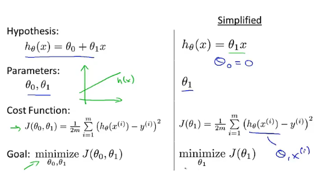

训练集为（1，1）（2，2）（3，3）这三个点

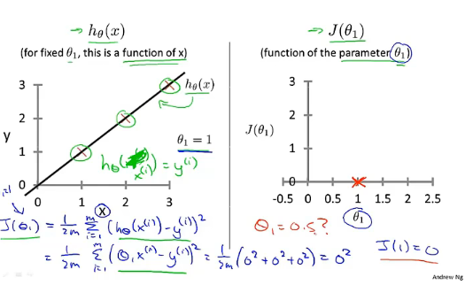

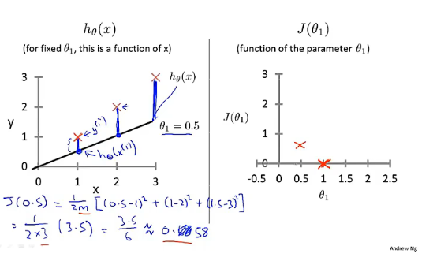

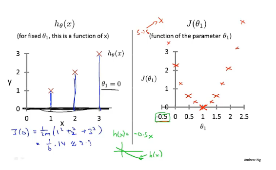

> 最小二乘法实际上就是用偏导数为0推导出来的极值点

**contour plots** or **contor figures**等高线图，更加直观的表示三维图像（二维变量下的代价函数）。

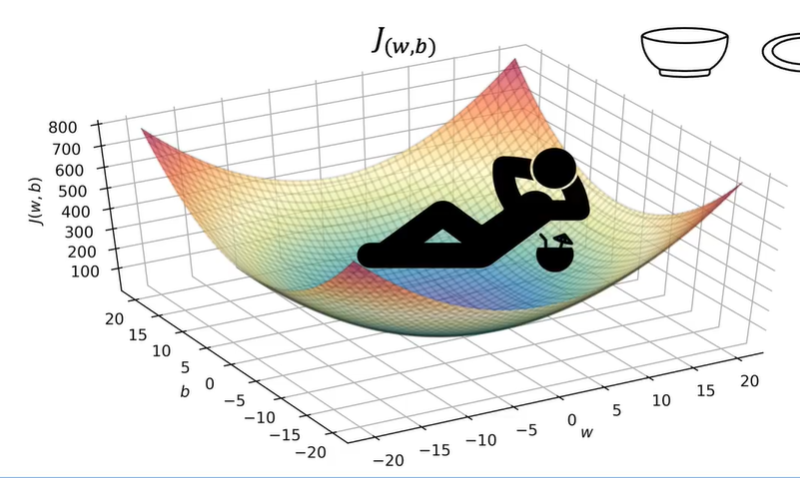

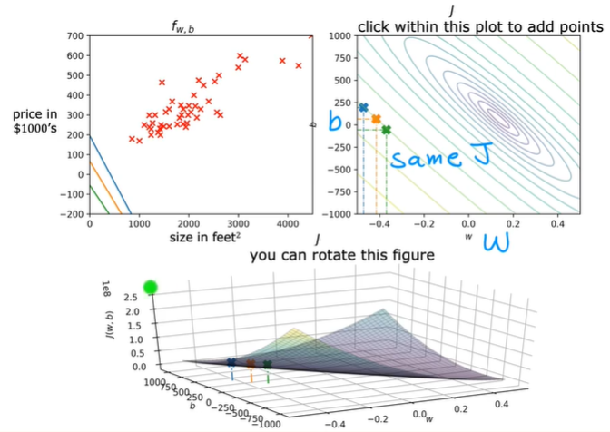

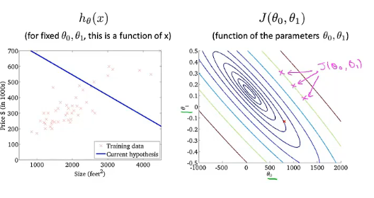

> 怎么设计来找到自动的计算程序，以及多维难以可视化的数据集。

## 梯度下降-Gradient descent algorithm

二元的线性回归最终都会是碗状结构。

 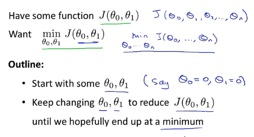

 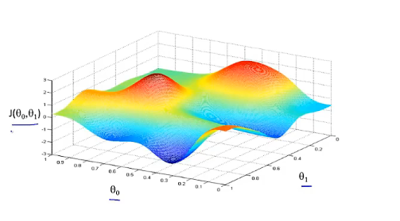

 梯度下降，实际上就是环顾一周，找到一个下降速度最快的方向——little baby step

 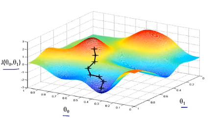

 ：=代表赋值，一个很好的计算机与数学的区分方式。

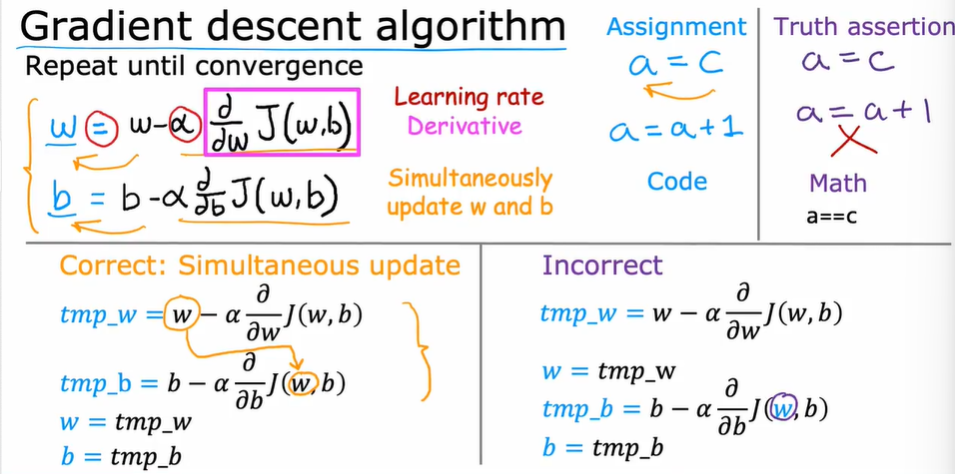

**注意**要同时更新两个参数

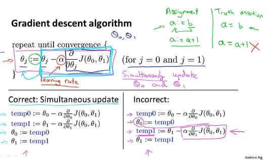

 $\alpha$记作是**learning rate 学习速率**

 对于怎样理解这个梯度下降算法，可以用仅一个参数的情况分析。 
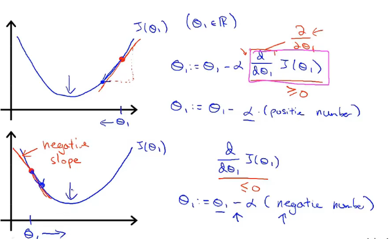

 - 在左侧，导数小于0，$\theta$会变大
 - 在左侧，导数大于0，$\theta$会变小
 - 实际上就是在向最小值点靠近（derivative-导数）


而对于$\alpha$的取值，过小会**变慢**，过大会**发散**（变化大小还与导数大小-斜率有关）在数值计算方法中，指出了$\alpha$也可以随着迭代发生变化（最后一步应该是0)

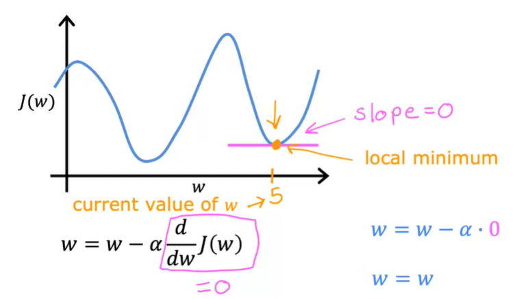

所以说，降到了最低点之后就不在下降了

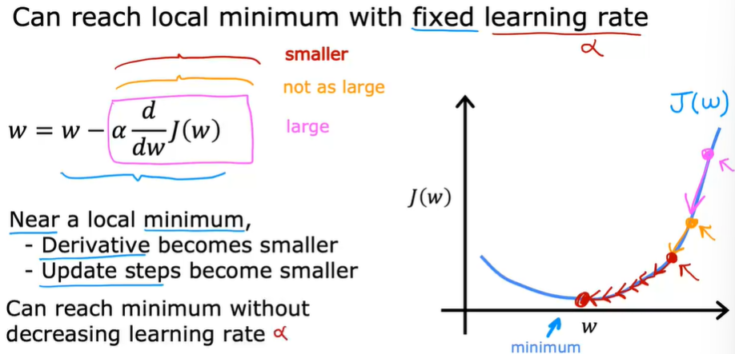

## 算法的实现

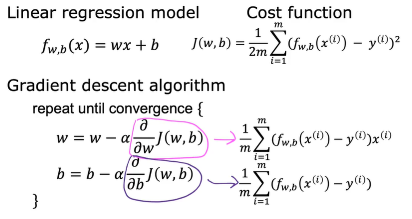
$$
实际上就是\frac{d}{dw}J(w,b) = 2\times J(w,b) \times \frac{J(w,b)}{w}
$$
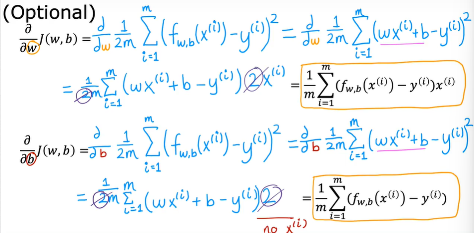

二元线性回归中只有一个极小值（全局最小）**convex function**（凸函数）

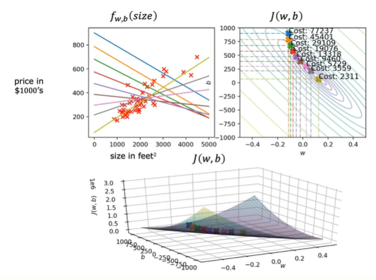

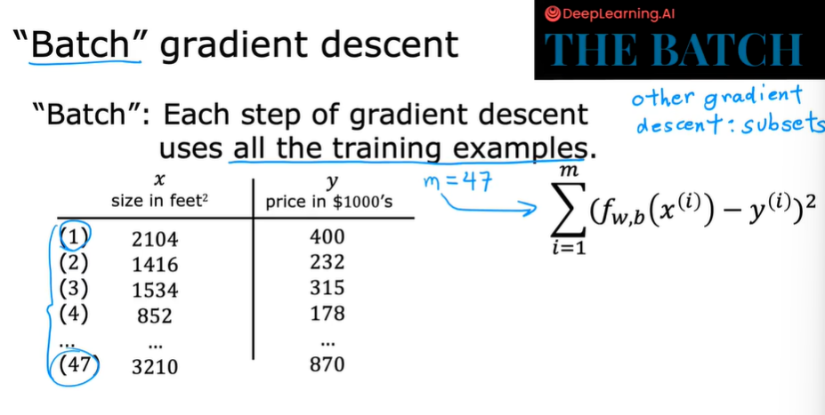

## 算法实现

自己实现以下算法

```matlab
生成一个随机的训练集
clc;clear;clf;
train_set = 10*rand(1000,2);
x0 = train_set(:,1);
y0 = train_set(:,2);
scatter(x0,y0)

首先绘制一下迭代等高线图
n = 100;
k = linspace(0.01,0.03,n);
b = linspace(5,7,n);
[kk,bb]=meshgrid(k,b);
z = 0;
for i = 1:length(x0)
    z = z + ( kk.*x0(i)+bb-y0(i)*ones(n,n) ).^2;
end
z = z/2/length(x0);
min(min(z))
contour(kk,bb,z);

然后我们试验一下梯度下降方法
%给出初始值
k = 0;%初始值随便改
b = 0;%初始值随便改
a = 0.04;%换称0.1就发散了，乐
figure
contour(kk,bb,z)
hold on
for i = 1:1000
    k1 = 0;
    k2 = 0;
    for j = 1:length(x0)
        k1 = k1 + ( k*x0(j) + b - y0(j) ) * x0(j);
    end
    for j = 1:length(x0)
        k2 = k2 + ( k*x0(j) + b - y0(j) );
    end
    plot(k,b,'o')
    k = k - a * k1 / length(x0);
    b = b - a * k2 / length(x0);
end

看看是否收敛
hold off
k = 0;%初始值随便改
b = 0;%初始值随便改
a = 0.04;%换称0.1就发散了，乐
n = 100000;
x00 = linspace(0,10,100);
kk = zeros(1,n);
bb = zeros(1,n);
for i = 1:n
    k1 = 0;
    k2 = 0;
    for j = 1:length(x0)
        k1 = k1 + ( k*x0(j) + b - y0(j) ) * x0(j);
    end
    for j = 1:length(x0)
        k2 = k2 + ( k*x0(j) + b - y0(j) );
    end
    k = k - a * k1 / length(x0);
    b = b - a * k2 / length(x0);
    kk(i) = k;
    bb(i) = b;
end
xx = 1:n;
z = 0;
for i = 1:length(x0)
    z = z + ( kk(n)*x0(i)+bb(n)-y0(i) )^2;
end
z = z/2/length(x0)
plot(xx,kk,xx,bb)
%到后面就收敛了，不过迭代次数有点儿多

```

其实在自己实现算法的过程中，发现了其实最难的**初始点**与**学习速率**的挑选，很容易就会发散

# WEEK 2


# 多特征向量（入门）-Multiple features

**vector**-向量

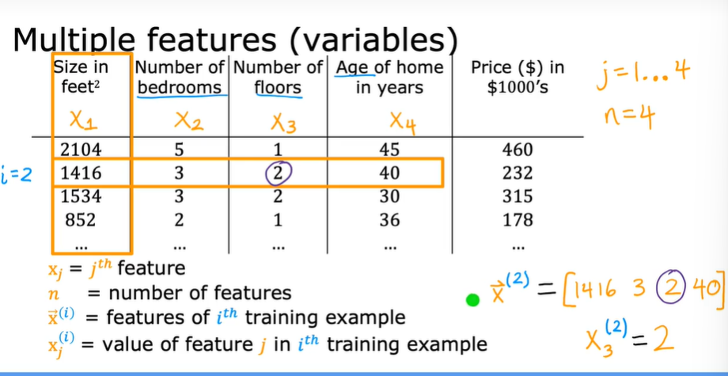

当我们考虑多个影响时，可以想象下面的这个形式来表述

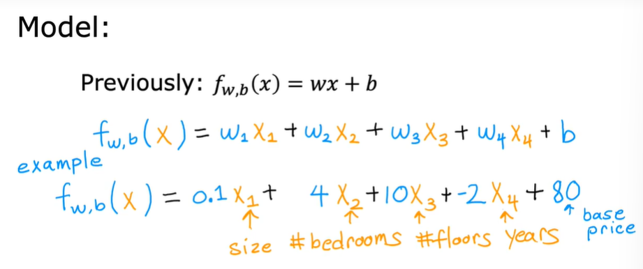

**dot product**-点乘


# 多元线性回归-Multiple linear regression

## 矢量处理-向量运算

**vectorization**-矢量化，可以更容易处理你的数据

> Python的索引是从零开始的

- 手动计算点乘

- 循环写法计算求和
- 向量的点乘

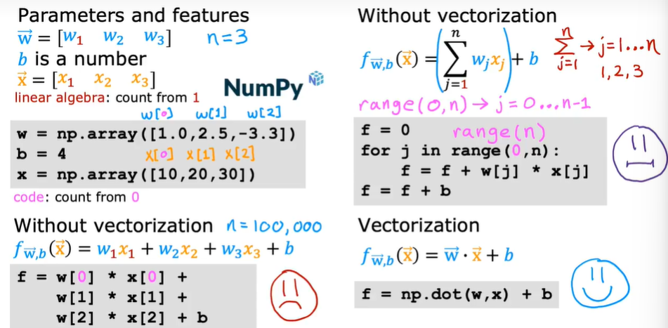

向量化可以更加方便运算与阅读，而且计算机的向量化是并行计算（硬件），相比于之前的会快很多。

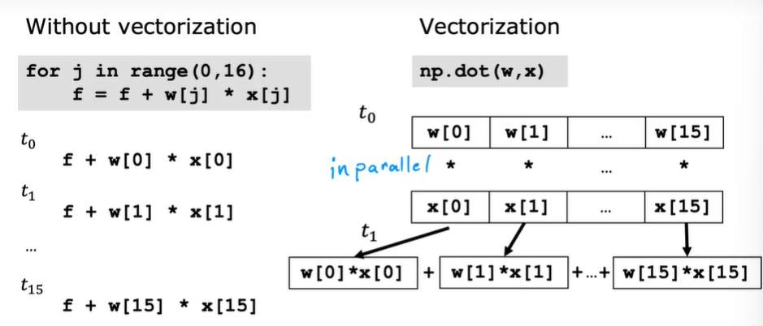

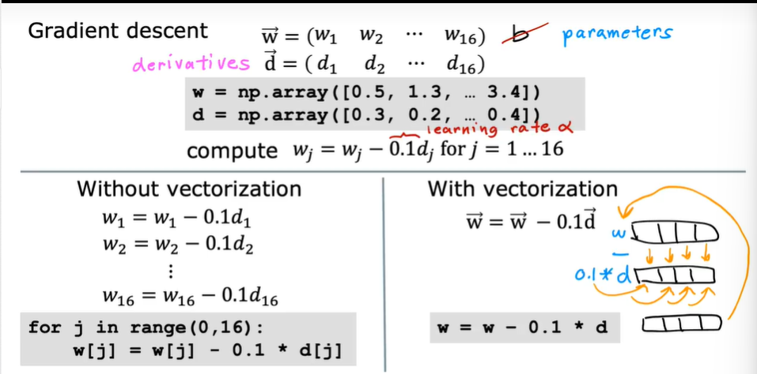

**向量化处理数据**-为了后续改善多元回归梯度下降

## 多元线性回归的梯度下降-Gradient descent for multiple linear regression

number-b，b不是向量，是个数。


$$
对w求导\quad \frac{d}{dw_1}J(\vec w,b) = x_1^{(i)}\quad其余项都是常数项
$$
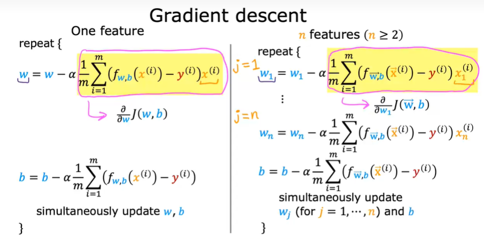

> **Normal equation**
>
> [详解正规方程（Normal Equation） - 知乎 ](https://zhuanlan.zhihu.com/p/60719445)
>
> （用到了很多的矩阵求导公式,可以用来检测结果）
>
> 优点：
>
> - 无需迭代
>
> 缺点：
>
> - 只能在多元线性回归中用到
>
> - 如果数据量过大，会很慢
>
>   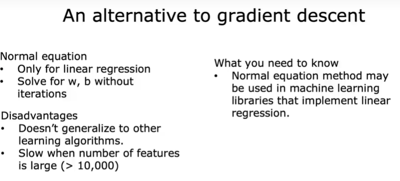

# 有关特征值与参数调节工程

## 特征放缩-Feature scaling

>  有的参数或者训练数据差异很大

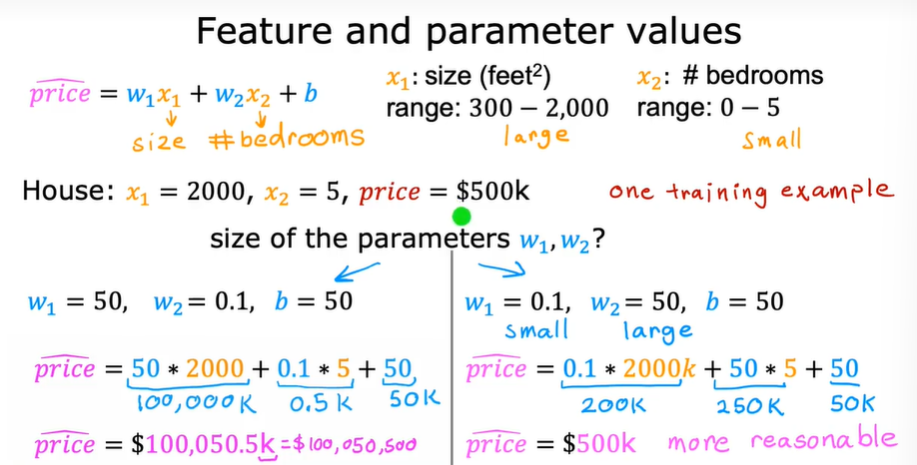

如何合理的取值（大小关系上）

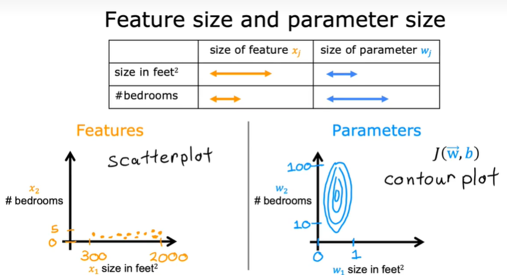

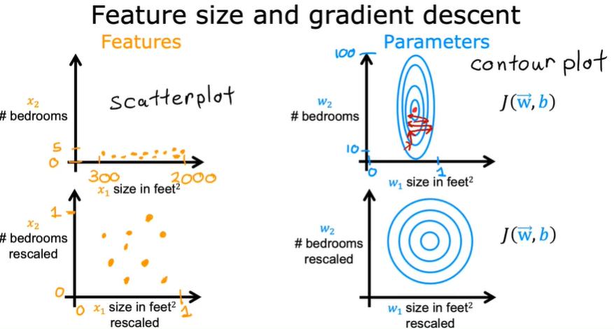

缩放后更加精确美观的标出我们的取值范围区域

- 训练向量集的归一化-**Mean normalization**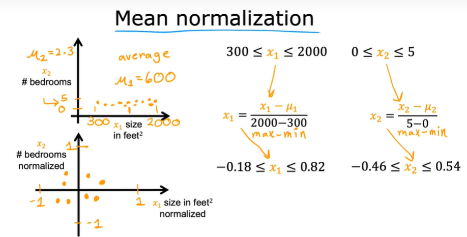
- Z-score 标准化**Z-score normalization**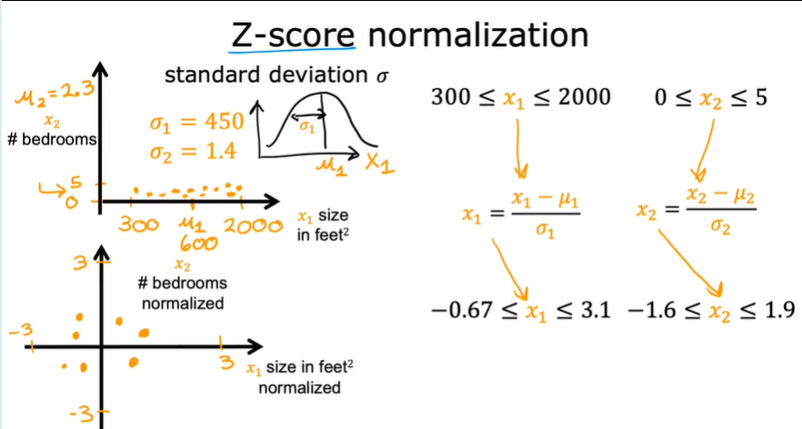

尽量使得所有的变量所属区间长度相近，特征放缩可以使梯度下降更快


## 检验收敛性-Check the convergence

### 怎么看收敛性

一般都是要单减，否则说明有bug或者$\alpha$选的不好


> 自动算法像是规定一个误差，减少基本趋于0时跳出。

### 如何选取$\alpha$


多带入一些$\alpha$的值进行测试（调参）


## 特征工程-Feature Engineering


用知识构造一个新的特征（变量）能够反映更多的特性，还可以使得整体更加拟合。

# 多项式回归-Polynomial Regression


此时，特征放缩-**feature scaling**尤为重要。那么该如何选，以后的课程会分析各种情况下的优缺点。

# WEEK 3

# 逻辑回归-Logistic regression

> 对于模型的输出-“y的值”，只对2元分类问题的中间过渡部分起作用，其他的具体形状之类的还是要用其他函数构成复合函数

**binary classification**-二元分类问题（class与category对等，即都代表了表示的结果类型）

逻辑回归指用0.1逻辑值表示输出（是，否；对，错；这边，那边。。。）


在分类的问题中，线性模型的线性性质会影响一定的判断。（添加了一个误差较大的值之后线性模型变化较大）


**sigmoid（logistic）function**-激活函数


考虑到概率问题


## 决策边界


逻辑函数都是带入到这个g函数中，这是我们预测的边界。[深度学习笔记：如何理解激活函数？（附常用激活函数）-知乎](https://zhuanlan.zhihu.com/p/364620596)


## 逻辑回归的代价函数-Cost function for logistic regression

以前的平方差公式并不是一个很好的评估公式


因为有0.1所以会有一些急剧的变化，此时不好取极小值，有很多局部极小值。

## 逻辑回归的代价函数


==最后会是一个**凸函数**（证明）==

以及为什么要用这个函数作为代价函数[损失函数：交叉熵详解 - 知乎](https://zhuanlan.zhihu.com/p/115277553)

> 总的来说就是信息熵，使得你的成本预算与实际价值成正比，上面是相当于交叉熵的形式，之不过取0.1的时候有一个项分别被删去了，交叉熵就表现出了你这个模型与实际模型之间的分布差异

例如，假设0和01都是码字，那么我们就不清楚编码字符串0100111的第一个码字是什么，因为可能是0，也可能是01。 我们想要的属性是，任何码字都不应该是另一个码字的前缀。 这称为**前缀属性**，遵守该属性的编码称为**前缀编码**。（信息传输的过程中会一起发送）


实际上就是极大似然估计的形式表达（使得两个分布相同概率最大的参数选取）**极大似然函数**


逻辑回归的梯度下降，
$$
关于导数的推导过程：\\
J(\vec w,b) &= -\frac{1}{m} \sum_{i=1}^{m}[y^{(i)}ln(f_{\vec w,b}(\vec x^{(i)})) + (1-y^{(i)})ln(1-f_{\vec w,b}(\vec x^{(i)}))]\\
& = -\frac{1}{m} \sum_{i=1}^{m}[y^{(i)}ln(\frac{1}{1+e^{-(\vec wx+b)}}) + (1-y^{(i)})ln(\frac{e^{-(\vec wx+b)}}{1+e^{-(\vec wx+b)}})]\\
&= \frac{1}{m} \sum_{i=1}^{m}[y^{(i)}ln(1+e^{-(\vec wx+b)}) + (1-y^{(i)})ln({e^{\vec wx+b}}+1)]\\
\frac{\partial J(\vec w,b)}{\partial w_j}&=\frac{1}{m} \sum_{i=1}^{m}[y^{(i)}\frac{\partial ln({1+e^{-(\vec wx+b)}})}{\partial w_j}+ (1-y^{(i)})\frac{\partial ln(e^{\vec wx+b}+1)}{\partial w_j}]\\
&=\frac{1}{m} \sum_{i=1}^{m}[y^{(i)}\frac{-x_j^{(i)}e^{-(\vec wx+b)}}{1+e^{-(\vec wx+b)}}+ (1-y^{(i)})\frac{x_j^{(i)}e^{\vec wx+b}}{1+e^{\vec wx+b}}]\\
&=\frac{1}{m} \sum_{i=1}^{m}[y^{(i)}\frac{-x_j^{(i)}}{1+e^{\vec wx+b}}+ (1-y^{(i)})\frac{x_j^{(i)}e^{\vec wx+b}}{1+e^{\vec wx+b}}]\\
&=\frac{1}{m} \sum_{i=1}^{m}[y^{(i)}\frac{-1}{1+e^{\vec wx+b}}+ (1-y^{(i)})\frac{e^{\vec wx+b}}{1+e^{\vec wx+b}}]x_j^{(i)}\\
&=\frac{1}{m} \sum_{i=1}^{m}[\frac{e^{\vec wx+b}}{1+e^{\vec wx+b}}+y^{(i)}\frac{-1-e^{\vec wx+b}}{1+e^{\vec wx+b}}]x_j^{(i)}\\
&=\frac{1}{m} \sum_{i=1}^{m}[\frac{e^{\vec wx+b}}{1+e^{\vec wx+b}}-y^{(i)}]x_j^{(i)}\\
&=\frac{1}{m} \sum_{i=1}^{m}[\frac{1}{1+e^{-(\vec wx+b)}}-y^{(i)}]x_j^{(i)}\\
&=\frac{1}{m} \sum_{i=1}^{m}[f_{\vec w,b}(\vec x^{(i)})-y^{(i)}]x_j^{(i)}\\
\frac{\partial J(\vec w,b)}{\partial b}&=\frac{1}{m} \sum_{i=1}^{m}[y^{(i)}\frac{\partial ln({1+e^{-(\vec wx+b)}})}{\partial b}+ (1-y^{(i)})\frac{\partial ln(e^{\vec wx+b}+1)}{\partial b}]\\
&=\frac{1}{m} \sum_{i=1}^{m}[y^{(i)}\frac{-e^{-(\vec wx+b)}}{1+e^{-(\vec wx+b)}}+ (1-y^{(i)})\frac{e^{\vec wx+b}}{1+e^{\vec wx+b}}]\\
&=\frac{1}{m} \sum_{i=1}^{m}[f_{\vec w,b}(\vec x^{(i)})-y^{(i)}]\\
二阶导数下凸的证明：\\
\frac{\partial^2 J(\vec w,b)}{\partial w_j^2}&=\frac{\partial \frac{1}{m} \sum_{i=1}^{m}[f_{\vec w,b}(\vec x^{(i)})-y^{(i)}]x_j^{(i)}}{\partial w_j}\\
&=\frac{1}{m} \sum_{i=1}^{m}\frac{x_j^2e^{-(\vec wx+b)}}{(1+e^{-(\vec wx+b)})^2}>0\\
$$

scikit-learn函数

# 欠拟合与过拟合-underfitting and overfitting

## 欠拟合与过拟合的介绍

> 无端瞎想：龙格现象

**regularization**正则化来解决过拟合问题

- **high-bias**-这里指欠拟合（强偏差）（性别种族特征嘎嘎）

  

- **generalization**-泛化(我们最希望的一个)

  

- **overfitting**-过拟合 or **high variance**-高方差

  

  

  

  ## 解决过拟合问题(三种方法)

  1. **增加样本数据**
  2. **特征选择**（减少特征数量/训练集维数）
  3. **正则化-regularization**（不是把系数变成0，而是变成尽量小）

  > 对b的正则化影响不大，不建议对其进行改动

  # 带正则化的代价函数-Cost function with regularization

  ## 代价函数的改进

  这里是代入计算了，比方说x取10，就有1000w_3，这里只是表示x取得很大时w惩戒系数比较大。


可以惩戒所有的特征（都给他变小）


两个权衡取最小，至于怎么取$\lambda$


## 线性回归的正则化

梯度下降法的变化


进阶技巧


实际上**前面的系数**说明了每次得带w都会变小一些，**后面的**是寻找最低点的迭代

# 逻辑回归的正则化


# WEEK 4

# 开篇

**Neural Networks**-神经网络

**inference**-推理

# 神经网络-Neural Networks

> 超级简化的人类大脑

## 神经网络介绍


NLP-自然语言处理


**axon**-轴突，**dendrites**-树突


大脑是如何工作的尤为重要，出发点是生物原理，但是更重要的还是工程原理，我们怎么有效的工作。利用神经网络可以利用更多的数据。


## 需求预测-Demand Prediction

**activation**-激活，**neuron**-神经元，**awarenss**-知名度

用神经元输出估价的概率


实际上下一层可以读取上一层的所有数据，每层输入一个数据，输出一个数据


**input layer** 输入层（layer0）-**hidden layer** 隐藏层（layer1）-**output layer **输出层（layer2）

> 输入层一般不记，故上述的只是一个==2层网络==

神经网络不用我们自己处理数据特征，可以借助网络自己生成合理的权重。


**architecture**-结构，:D

## Example:视觉处理-Face recognition


第一层：找各种直线；第二层：检测脸部部位；第三层：组成人脸；实际上是从小到大的区域范围搜索（不过都是机器自己学习）


不仅仅是人脸，这套系统会自动小范围到大范围找到合适的分类（比如对汽车）


## 神经网络层-Neural network layer

1. 第一步，计算layber1


【i】的数据输入到【i+1】

2. 第二步，计算layber2


3. 第三步，对结果进行判断


## 更加复杂的神经网络


信息输出与传递的方程（第一层就是$a^{[0]}$）


# 推理-Inferencing

## 向前传播(手写识别)-forward propagation


forward propagation-向前传播，传播激活信号

## 代码部分-Inferencing in code

- 咖啡豆问题-coffee roasting


要加载各个参数以及库的提取应用。

- 手写识别问题


## Tensorflow 中的数据

numpy中的矩阵数据表达：


**row**-行，**column**-列


最后一个只是表达一组数据；**tensor**-张量，用来储存数据。张量可以视为高维矩阵的储存方式（用长方体储存数据）


> 这里最后一行应该是弄错了,应该只是转了一下格式


# 构造一个神经网络

## 调用库写函数

model中sequential用来给layer排序。然后输入数据去训练


一遍一遍的驯化这个函数


这就体现了库的方便，但是还是要实际上理解库中的东西，要了解算法怎么工作的。

## 单层中的前向传播-Forward prop in a single layer


> 这里是先算的下面再算的上面，==w2_1中应该是三维向量==，可以改成([-7，8，9])

**实现方法**-Tensorflow算是一种张量计算的架构

定义函数，输入上一层参数，系数阵，得到下一层参数。


> 实际上这里应该用矩阵（向量）相乘更好-a_in乘W+b
>
> 会根据代价函数一步一步往前修改参数（反向传播）

- **前向传播（Forward Propagation）**前向传播就是从input，经过一层层的layer，不断计算每一层的z和a，最后得到输出y^ 的过程，计算出了y^，就可以根据它和真实值y的差别来计算损失（loss）。
- **反向传播（Backward Propagation）**反向传播就是根据损失函数L(y^,y)来反方向地计算每一层的z、a、w、b的偏导数（梯度），从而更新参数。

# AGI猜想-Is there a path to AGI

**ANI**-Artificial General Intelligence-强人工智能，**AGI**-Artificial Narrow Intelligence-弱人工智能


我们想的可能越多的neuron，就能模拟人脑，但是还是太简单，未能达到模拟人脑的程度。

"one learning algorithm" hypothesis-简单算法猜想

听觉的切断把视觉输入，会自动接受视觉（就像有一个算法，我们的算法“大脑”接收数据并生成结果）


生物具有惊人的适应性，那么能够复制这些算法吗。

# 向量化求解-矩阵部分

- 向量化的成就铸就了今天的深度学习


看是否大于0.5取得0，1所以最后输出的都是0.1

- **dot product**-点积（点乘），**transpose**-转置


向量化复杂，但是很值

# 神经网络向量化实现


直接用矩阵乘积进行传播。

# WEEK 5

# 训练神经网络

## 模型代码介绍

**SparseCategoricalCrossentropy**-稀疏分类交叉熵


- Step 1 构造模型
- Step 2 定义代价函数-compile（编译）
- Step 3 拟合函数

## 训练细节

**specify**-指定，列入


下面详细介绍神经网络的细节：**BinaryCrossentropy**-二元交叉熵函数


可以调用[不同的损失函数](https://zhuanlan.zhihu.com/p/44216830)such as **MeanSquaredError**-平方差

实际上要求偏导时在函数中都帮你做到了。


（大佬们的库）

# 激活函数

## 之前讲过的一些激活函数

把很多很多的0.1函数写进整个模型：就像神经元一样。

ReLU函数-**Rectified Linear Unit**(矫正线性函数)


## 激活函数的选择

- 二元分类问题-**Sigmoid**
- 回归问题-**Linear activation functions**线性激活函数
- 非负回归问题-**ReLU**


往往**Sigmoid**会使得梯度下降变慢


每年都会有新的激活函数提出

## 激活函数的重要性

> 就是不要老去用线性回归，本末倒置了


像这样化成两层去线性回归，还不如直接用一个线性回归。


每层中都用线性回归，最后用sigmoid的话，结果出来跟逻辑回归没区别


# 多类问题-Multiclass Problem

## 多类问题介绍


> 个人想法：把后三类分成一类，然后一步一步二分类（比较慢）

## Softmax激活函数

**embelish**-美化（泛化，推广）


n=2的时候
$$
a_1 = \frac{e^{z_1}}{e^{z_1}+e^{z_2}} = \frac{1}{e^{z_1-z_2}+1}\\
a_2 = \frac{e^{z_2}}{e^{z_1}+e^{z_2}} = \frac{1}{e^{z_2-z_1}+1}
$$
所以参数会有些不一样（因为之前是$z$后面的是$z_1-z_2$，所以$z = z_1-z_2$，参数上也会发生相对的变动。


是等价的，但是数值上不一定是一样的，用ln函数只要是加大惩罚力度，让$a_j$达到接近1的情况（其实另一个会趋近于oo，主要还是加快迭代速度），以使得代价函数最小。


## softmax与神经网络

特有属性，比喻要把所有的z计算出来才可以算a


**SparseCategoricalCrossentropy**-稀疏类


## softmax改进代码

> 怎么更加精确的计算


表明直接的表达式会更加的精确

把z记为中间量而不是a


对之前的逻辑回归问题


# 多标签分类问题-Multi-label classification

**pedestrain**-行人


- **多类型**与**多标签**的差异
- 多类型输出的是每一种值的可能性（0.1，0.2，0.7）

- 多标签输出的是每一个的取值（0，1，0）

# 进阶优化算法

之前的是一个固定的learning rate，现在，我们可以找到一个更加自动化的算法**Adam**


**Adaptive Moment estimation**算法


**Robust**-健壮（容错更高）

# 小拓展

**dense layer type**-连接层（后一项数据由前一项给出）


卷积层-**convolutional layer**，卷积神经网络-**CNN**（convolutional neural network）


目前一些其他的前沿模型：**Transformer**,**LSTM**(长短期记忆网络）,**attention**（注意力模型）

# WEEK 6

# 前言


**fruitful**-卓有成效的


**diagnostics**-诊断学 

# 模型评估-ebaluating model

## 应用到线性回归


如果只是绘制，那么4维数据就画不出来了；划分训练集，一部分训练，一部分检验。


三七分或者二八分


## 应用到分类问题


被错误分类了，就记为1，所以J的数值代表了分类错误的数据个数。

# 模型选择与交叉验证

## 选择方法与交叉验证


这样其实有一些推广后的误差，不是很合适。下面介绍一下怎么筛选更加科学。

**cross validation**-交叉训练集，用来检验准确性，其他称呼：


也可以用到神经网络上（不同的层数，不同的单元）


[本初ben](https://www.zhihu.com/question/265443164/answer/2417856431)

- **训练集**

**参与训练**，模型从训练集中学习经验，从而不断减小训练误差。这个最容易理解，一般没什么疑惑。

- **验证集**

**不参与训练**，用于在训练过程中检验模型的状态，收敛情况。验证集通常用于调整超参数，根据几组模型验证集上的表现决定哪组超参数拥有最好的性能。

同时验证集在训练过程中还可以用来监控模型是否发生过拟合，一般来说验证集表现稳定后，若继续训练，训练集表现还会继续上升，但是验证集会出现不升反降的情况，这样一般就发生了[过拟合](https://www.zhihu.com/search?q=过拟合&search_source=Entity&hybrid_search_source=Entity&hybrid_search_extra={"sourceType"%3A"answer"%2C"sourceId"%3A2417856431})。所以验证集也用来判断何时停止训练。

- **测试集**

**不参与训练**，用于在训练结束后对模型进行测试，评估其[泛化能力](https://www.zhihu.com/search?q=泛化能力&search_source=Entity&hybrid_search_source=Entity&hybrid_search_extra={"sourceType"%3A"answer"%2C"sourceId"%3A2417856431})。在之前模型使用**验证集**确定了**超参数**，使用**训练集**调整了**可训练参数**，最后使用一个从没有见过的数据集来判断这个模型的好坏。 **需要十分注意的是：测试集仅用于最终评价模型的好坏，在测试集上得到的指标可以用来和别人训练的模型做对比，或者用来向别人报告你的模型效果如何。切记千万不能根据模型在测试集上的指标调整模型超参数（这是验证集应该干的事情），这会导致模型对测试集过拟合，使得[测试集](https://www.zhihu.com/search?q=测试集&search_source=Entity&hybrid_search_source=Entity&hybrid_search_extra={"sourceType"%3A"answer"%2C"sourceId"%3A2417856431})失去其测试效果的客观性和准确性。**

# 模型参数选择

## 诊断方差偏差

从这里就只考虑train跟cv两个数据集了，text数据集只是用来做展示（输出）用的，不参与状态检验，只是用来评估

单个变量比较直观，**bias**-偏差，**variance**-方差


可以画出不同模型下的偏差与方差的图像


两者同时发生：那就太惨了

- 高偏差-high bias：训练集训练的不够拟合
- 高方差-high variance：cv集比训练集表现得还差

## 正则化参数

$\lambda$大会把w的值压低，越不尊重实际的训练值（Jtrain会变大）


看着是对称的（方差看Jcv，偏差看Jtrain）

- ==左侧==的**左边**是$\lambda$比较小，过拟合，方差大，偏差小，**右边**是$\lambda$比较大，欠拟合，方差大，偏差大

- ==右侧==是**左边**次数低，欠拟合，方差大，偏差大，**右边**是次数高，过拟合，方差大，偏差小

# 误差的分析

## 搭建性能-Baseline（基线）

例子：语音识别：尽管看着他的方差，误差都挺大的，实际上人类自己识别也很难


要建立个性化的性能基准

## 学习曲线-Learning curves

三个点确定一个二次方程（三个未知数）


- **high-bias**


> 因为是$J_{train}$跟$J_{cv}$取得平均值，所以不会取余无穷（无穷的1取平均最后也是1），而且大于最小值，小于最大值（最大值与最小值有限）故这个平均值有界

- **high-variance**

误差低到不切实际


实际上最好的情况是三者相等，模型最接近人类（一味的扩大训练集，花费很很高）

## 误差与方差的分析（下一步该改进什么）

> 考虑的多了之后，有足够的信息去评估，就不会出现欠拟合情况(high bias)


- 扩大训练集-让拟合想过更好，更符合现实，对于high bias问题作用不大，但是能使得high variance更加拟合
- 减少特征向量-模型不会过于复杂（不会过拟合）对于high variance更小，但是对于high bias甚至可能从过拟合变成欠拟合
- 增加特征向量-模型变复杂，像过拟合过度所以对high bias有效，high variance作用小
- 增加次数项-相当于增加特征向量
- 减小$\lambda$-w的占比更小，自由发挥，趋向于过拟合，治疗high bias的问题
- 增大$\lambda$-w的占比变大，会压制w，趋向于欠拟合，治疗high variance的问题

> 主要是看趋向于欠拟合还是过拟合，==欠拟合（high bias）==，==过拟合（high variance）==

- **high variance**：1，增加训练集；2，简化模型：减少特征向量or增大$\lambda$；这样就很难拟合复杂曲线。
- **high bias**：复杂模型：增加特征向量or减小$\lambda$


# 神经网络与误差偏差

**tradeoff**-权衡


首先进行模型扩张，起码要比人强


> 误差大了就扩大网络，方差大了就增多数据

只要正则化选择的正确，就不会出现过拟合导致方差增大，==大的网络往往更好==


**非正则化**与**正则化**的模型

# 机器学习的迭代循环


蜜罐计划-**Honeypot**

蜜罐的定义（from 百度）

首先我们要弄清楚一台蜜罐和一台没有任何防范措施的计算机的区别，虽然这两者都有可能被入侵破坏，但是本质却完全不同，蜜罐是网络管理员经过周密布置而设下的“黑匣子”，看似漏洞百出却尽在掌握之中，它收集的入侵数据十分有价值；而后者，根本就是送给入侵者的礼物，即使被入侵也不一定查得到痕迹……因此，蜜罐的定义是：“蜜罐是一个安全资源，它的价值在于被探测、攻击和损害。”

设计蜜罐的初衷就是让黑客入侵，借此收集证据，同时隐藏真实的服务器地址，因此我们要求一台合格的蜜罐拥有这些功能：发现攻击、产生警告、强大的记录能力、欺骗、协助调查。另外一个功能由管理员去完成，那就是在必要时候根据蜜罐收集的证据来起诉入侵者。

# 如何高效的改进模型

## 误差分析-error analysis

有的很多错误分类的数据，自己看一遍然后分析其中的问题所在


指出模型实际上应该朝着什么方向发展才更好（再怎么优化恶意拼写，也只能解决3%的问题）

**pharma**-药品


**error analysis**的重要性

## 数据添加-adding data

>  专项的添加需要的数据，比一味的添加各种数据更加有效，怎么寻找方法来改进代码

**数据增强**-Data augmentation：用已有的例子去构造新例子


构造丰富的数据库，让机器学习的更加稳健


音频的叠加与加噪，用来训练


有一些处理，比如说噪点之类的，平时生活中遇不到，所以就不做这些处理

**OCR**算法


右侧是自己做的数据集，说明完全可以自己去生成数据集以减少处理数据花费的时间


有的专注于改进代码，有的算法已经够好了，就要在数据上下功夫

## 迁移学习-transfer learing

> 把其他的数据用到自己的身上（但是要相近，比如识别猫的用来识别狗）就像兽医给人看病

option1适合小的网络，opinton适合所有的(小的用1比较好)，**Fine tuning**-微调


就像识别人之前，可以先训练去学习识别其他东西（这里相同的类型指不要用图像识别去识别语音）


微调就可以用少量的数据集去训练


主要是大家可以用来互相交流，用那些训练过的大型网络

# 构造系统的全流程


- 确定计划
- 收集数据
- 模型训练（再看看还要什么数据）
- 发布（维护，更新）

**inference server**-推断服务器，**monitoring**-监控系统（统计什么时候训练不好以方便观察改进）


**opera**-维护，运作

# 公平，偏见，伦理-fairness，bias，ethics


要对社会有积极影响，不要为了钱而损害社会

**diverse**-多元化（种族，性别，信仰等等，这里指团体的）

**audit**-检查，审计，大学生旁听


# 选修-数据倾斜与优化方法

## 数据倾斜介绍

数据并非55开，错误数据很少时


如果是一个很罕见的症状，正确率99.5%或者说错误率0.5%，也说明误差最小的不一定是最准的

**precision**-精确率（你识别的这些阳性，有多少是真阳的），**recall**-召回率（所有的阳性里，真正识别出来的是多少）


如果只是print（y=0)那么矩阵是[0 0;1 99],此处假设100个人里1个阳性，那么precision是0/0（无定义or不存在精度），recall是0

## 权衡精度与召回率

精度-==找的对==，召回率-==找的全==，实际上喜欢两个都高

阈值提高（更自信才预测）-[小 小；大 大]精度提高（更值得相信），但是召回率变小（看公式）

阈值降低（都来治病）-[大 大；小 小]精度降低，召回率变大

**threshold**-门槛，阈值


==推导过程==
$$
&pre = \frac{tru}{tru + fal pos}\\
&rec = \frac{tru}{tru + fal neg}\\
阈值提高：&tru小，falpos小，falneg大，truneg大\\
&pre = \frac{1}{1+\frac{falpos}{tru}}\\
&falpos = a - x,tru = b - x,\frac{falpos}{tru}=\frac{a-x}{b-x} = 1+\frac{a-b}{b-x}\\
&一般来说，a<b,所以在x从0到min\{a,b\}过程中，比值减小，pre增大\\
&rec = \frac{1}{1+\frac{falneg}{tru}}\\
&比值变大，rec变小\\
阈值降低：&tru大，falpos大，falneg小，truneg小\\
&pre = \frac{1}{1+\frac{falpos}{tru}}\\
&falpos = a - x,tru = b - x,\frac{falpos}{tru}=\frac{a-x}{b-x} = 1+\frac{a-b}{b-x}\\
&一般来说，a<b,所以在x从0到-\infty过程中，比值变大，pre减小\\
&rec = \frac{1}{1+\frac{falneg}{tru}}\\
&比值变小，rec变大
$$


找个方法把两个数结合成新数（平均值，不推荐，不够有效，容易一边倒）**F1 score**更强调小的那个数


# WEEK 7

# 决策树

## 猫猫分类案例-可爱捏


跟绿萝一样，根在上面，叶子在下面

**root node**-根部节点，**decision nodes**-决策节点，**leaf nodes**-叶节点


## 学习过程-learning process


先按耳朵形状分类


然后按照脸型分类


当样本足够纯（全是猫or全不是猫）时，添加叶节点


1. 怎么确定用什么特征来划分
2. 何时停止分类（很纯的时候or有限制深度or纯度增加太小时or精度达到时）

## 熵的引入

entropy-熵，数值越大越不纯


$$
显然，p_{a}=1-p_{1-a}
$$


实际上之前的那个代价函数就是交叉熵，算是这个的一种

## 选择拆分信息增益


我们比较希望出现小的，因为越接近0，他的内容就越纯（全是猫，或全是狗）我们就可以给他添加叶节点了。我们可以看熵的变化-**information gain**，下一层熵的值用加权平均计算。


下降多的表现更好


## 整合


从左到右依次加入leaf node-叶节点


**recursive algorithm**-递归算法-不断地建立小的决策树


有很多方法来决定何时停止，实际上也有很多的开源库可以利用。

# 分类特征

## 独热-one hot

> 上述我们的那些都是二元值，而我们下面用的是多元的编码


二进制的表达方式（实际计算时就是按照1.0划分）


**one-hot encoding**-独热编码，这样就可以取更多的离散特征值


## 连续值的特征


选择信息增益最好的那一个中间值


# 推广

## 回归树-regression trees

图中是求的平均值


（此时就不考虑熵的变化，而是要考虑减少方差了）计算加权方差


## 集成树-tree ensembles

> 单个的树对信息的敏感性很高


这样的话，整体的树就不会对某个数据过于敏感


## 有放回抽样-sampling with replacement

replacement-放回


## 随机森林法

> 非常强大的一种树模型，


最后让这些树群进行投票，往往更加有效，相对于单个树来说（其实就是为了快而增大训练量）

为了让树与树之间差异较大（要是都一样那也没意思）所以特征选择一般是n个的元素个数为k的子集，然后以这k个特征来训练(k一般取$\sqrt{n}$)


## XGBoost-eXtreme Gradient Boosting

>  决策树集成方法-XGBoost


更多的选择让之前决策错误的例子（多样性训练集）-这样就像可以练习，每次都练习自己不熟悉的部分


下面介绍这个开源的算法的优点


# 什么时候用决策树

> 表格数据（不建议用在图像，音频上）


神经网络中更多的调用连续函数，更加方便梯度下降训练

# WEEK 8

# 前言

无监督学习：聚类，异常检测anomaly detection

推荐系统-商业，广告

强化学习：电子游戏


# 聚类-clustering

## 聚类的介绍

非监督学习的一种，之前也提过，但是不给y的标签了，让机器自己分类


让机器自己寻找结构，可以将其分成簇-**clusters**


宇宙中的星系

# k-means均值聚类算法

找到簇质心-**cluster centroids**

**Step0**.随机找两个点-簇质心

**Step1**.历遍所有点，按照距离远近的划分为两个簇

**Step2**.移动簇质心，然后重复**Step1**


然后再依次重复下去


最后到稳定收敛就可以了

实际上就是每个簇应该有一个质心，只不过是通过这种方式来从外围步步迭代到质心

## k-means代码实现

质心的维数与数据集每个数据的维数相同，k个就代表你刚开始放了k个质心点

- Step 1

$$
这里就是要找离x^{(i)}最近的k值(u_k点)，min_k{||x^{(i)}-u_k||}，这里是二范数(距离空间的距离)
$$

- Step 2

  计算质心位置


> 边界情况：如果出现0个点距离近，那么可以去掉这个点，k=k-1，或者直接再随机分点

其实只要不是同一个点，就会自动分成两个簇（不然全在垂直平分线上）


> 即使区分不那么明显，也可以起到一定的价值作用

## 代价函数-distortion function


**distortion**-失真or畸变，**index**-返回值函数


> 中间那一项算的是中点（质心）（余弦定理）


> 至于这里为什么要找质心，我们可以稍微一想

$$
我们假设簇中心坐标为p_0 = (x_1,x_2,x_3,\dots ,x_n)\\
假设所有的样本点为\{p_m = (x_1^{(m)},x_2^{(m)},x_3^{(m)},\dots,x_n^{(m)})\}\\
那么求最短距离就是min \sum_{i=1}^m||p_0 - p_i||^2\\
展开来，就有\sum_{i=1}^m||p_0 - p_i||^2 = \sum_{i=1}^m[(x_1-x_1^{(i)})^2+(x_2-x_2^{(i)})^2+(x_3-x_3^{(i)})^2+\dots+(x_n-x_n^{(i)})^2]\\
=\sum_{i=1}^m(x_1-x_1^{(i)})^2+\sum_{i=1}^m(x_2-x_2^{(i)})^2+\sum_{i=1}^m(x_3-x_3^{(i)})^2+\dots+\sum_{i=1}^m(x_n-x_n^{(i)})^2\\
从这里也可以看出来，其实不过多少维的数据集，x_i与x_j之间都是相互独立的(都是整体的一个基向量)整体的最小值即研究\\
\sum_{k=1}^m(x-x_k)^2的最小值(一维直线上的点平方和最小)\\
记函数为f(x) = \sum_{k=1}^m(x-x_k)^2 = mx^2-2\sum_{k=1}^mx_kx+\sum_{k=1}^mx_k^2\\
可见，是一个二次函数，开口向上，最小值为x = \frac{\sum_{k=1}^mx_k}{m}时，即质心位置
$$

## k-means 初始化

可以直接挑某几个点作为初始迭代点


但有时会导致局部最优值


最佳的还是从上述的题目中挑出来代价函数J最小的情况


方法就是初始化的所有尝试中选择J最小的先

## 集群数量的选择

> 因为是无监督学习，所以没法给出一个很具体的正确答案方向，即没法告知优化方向

选择k值的一种方法-**肘部法则**-**elbow method**


> 很多时候也是看实际上的利用价值，以及图像的压缩

# 异常检测-Anomaly detection

## 异常检测介绍

> 异常检测通过观察正常事件的未标记数据集，从而学会检测异常或者在异常事件发生时告知

测试集是否与训练集相似？（有点儿像数理统计）


很像假设检验-接受H0与拒绝H0


## 高斯正态分布-Gaussian distribution

> 也叫**bell shaped distribution**（钟型分布）


实际上要是只考虑单个的正态分布信息，怎么综合考量成了一个问题


上式实际上是极大似然估计，统计学多用无偏估计


嘎嘎，远古课件限时返厂

## 异常检测算法

> 基于事件的独立性，我们可以得到向量的概率值为基向量概率乘积


嘎嘎，数学知识普及：


概率过小就是异常现象，即小概率事件

> 这里实际上是假设各个特征独立，所以直接相乘就是分布函数，但是一般会是多元正态分布


## 异常检测的设计与评估


实际上之事告诉了一个划分标准，并没有告诉数据集里哪些坏哪些好


数据倾斜是如何改正修改

> 实际上这里已经很想0.1分类监督学习了

# 选择技巧

## 监督学习vs异常检测

- 监督学习：数据错的跟对的都很多
- 异常检测：数据大部分都很正常


> 例子：Fraud-金融诈骗：有很多的方法，每年每月都有很多新的诈骗形式，异常检测就可以找到与之前不同的异类。Spam-垃圾邮件：但是监督学习是学习之前的不好的案例，然后接着找不好的。In short：异常检测能检测出新错误（新情况），监督学习是根据之前的给你分类（只是搬运工）。

**一个关注过去，一个着眼未来**


## 特征的选择

> 异常检测肯定得好好选，要不然有一个不是高斯分布，会影响整个的分布

尝试去转化一些特征的分布(数据的预处理)


上面是几种不同的转换（有的ln会出现0，我们+0.000001**加小值**即可）

记得对cv与test数据集也转换


出现一些判断错误时，可以单看同一概率下其余数据的具体特征，添加或者删除某些不正常的点


如果正常是大-大，小-小，那么可以建立一个新的特征是二者的比-就会出现异常值


# WEEK 9

# 前言

什么是推荐系统？

> r表示打分与否，y表示打的分


# 基于协同的过滤算法-collaborative filtering algorthm

## 推荐系统的代价函数

> $w^{(j)}$跟$b^{(j)}$指的是第j个人的观影参数系统，$x^{(i)}$表示第i个电影的特征值


> 最后那个是防止过拟合的正则化


实际上消去$m^{(j)}$这一常数并不会影响太多，所以底下都去掉了，可能感觉上求和的权重不一样了，但是$w^{(i)}b^{(i)}$与$w^{(j)}b^{(j)}$之间是相互独立的，也就是说这个$m^{(j)}$权重只是影响$w^{(j)}b^{(j)}$，不会影响其他的，所以可以去掉（只是==并行计算==而已）


对所有用户来求（可以用到矩阵的运算）

## 协同过滤算法-Collaborative Filtering algorithm

> 当这些特征值未知时


实际上很像用$w$去估计$x$了，实际上就是解方程，但是要考虑最小二乘解

> 用x去估计w，b就是看一个人对不同电影的评价
>
> 用w，b去估计x则是看所有人对一部电影的评价


> 两者对比与总和，即同时优化wb与x


- 梯度下降法


实际上是在处理时利用了横纵上特征的关系来构造的一个关系式，更加符合逻辑

## 二值标签-binary labels

> 一般是喜欢或者不喜欢


熟悉的交叉熵函数(01规划常用的)


# 推荐系统的实现

## 行的归一化

> 由于正则化，Eve的参数将会全是0，这并不符合预期


 

> 加了一个平均值，实际上就是把大家伙的口味给他，且只对Eve有效，因为其他人的wb不是0

归一化列表示这个新电影是否展示出来，其实没那么重要，而归一化行可以看出来这个电影的评价是怎样的

## tf实现协同过滤

Tensorflow可以直接帮你计算微积分与导数


这里中间部分是自己构造了一个$costJ$函数


zip的添加是为了把参数打包成组，更容易调用查阅

> 不用之前的方式实际上是因为之前的方法更多是用来拟合，而非此处差异化表现的连接，主要还是Tensorflow更加高效

## 找到相似商品

> 吴佬是个星战迷呀，课上两次出现星战了


实际上就是根据特征$x^{(i)}$来判断是否相似


> 很少的人评估时，我们如何推荐？如何用上更多的用户个人信息进行分析？
>
> 

# 基于内容的过滤算法-content-based filtering algorthm

## 内容过滤vs协同过滤

更加个性化的推荐（实际上像是不仅仅是对movie打分，还有更多层的运算）


> - 协同过滤：就是跟你差不多的人都喜欢玩原神，我们就给你推荐原神
> - 内容过滤：就是你也喜欢原神类型的游戏，但是更喜欢主机游戏，我们就给你推塞尔达


> review：one-hot是[one-hot-coding](第七章-决策树与随机森林.md)一种编码方式


u-user,m-movie


In short：我有一堆人的喜好特征，一堆电影的特点，怎么match最佳(与之前的光看打分算是升级版)，下面就是怎么算$v_uv_m$

## 深度学习实现内容过滤


多参数输入的神经网络


> 这里的实际上就是之前的附近的推荐值


可以预先进行计算，求出来最适合的点，而不是先让客户打分然后再计算

## 从大目录中推荐


**genre**-种类，类型

- Step 1-**Retrieval**-检索


- Step 2-**Ranking**-排名

> 用模型仅对检索后的电影进行排名（减少不必要的工作量），而且只计算$v_u$即可


> 这样做可以让算法跑得更快，更好，但是如果加大数据量，那么还是可以冒险一试


## tf中实现内容过滤

- 前两行用来建立模型-relu激活函数-**max(0,x)**
- (==x==)第三行计算$v_u$并归一化（2范数为1）
- 第四行计算$v_m$并归一化（2范数为1）
- 然后取点积输出output(==y==)


# 社会伦理问题

> 科技的目的是让大家生活的更好


**良性循环**


**恶性循环**


剥削性业务的存在：**exploitative**-剥削


希望更加透明：**transparent**-透明度，**amplify**-放大，**conspiracy**-阴谋论，**toxicity**-毒性作用

**amelioration**-改进，**welfare**-福利

# WEEK 10

# 前言-什么是强化学习

**reinforcement learning**-强化学习


我们如何编程来让他自己飞行，让他倒飞


**state x** to **action y**

有点儿像训狗（奖惩机制）-**reward function**-奖励函数


无监督学习，只要给他一个奖惩函数，让他自己学习

# 强化学习

## 案例：Mars rover example

**Mars rover**-火星漫游者，**terminal state**-最终状态

- s-state，a-action，R-reward，s'-next state


## 强化学习中的回报-Return

快速少回报vs慢速多回报  折扣因子-$\gamma$


可以理解成货币的时间价值（利息）


可以对比，取**max**，得到最终方案


实际上是在把副作用推到未来，越发展乘的次数越高，越不值钱

## 强化学习中的策略


## 复习关键概念-马尔可夫决策过程MDP


> **Markov Decision Process**-马尔可夫决策过程
>
> 未来只取决于目前的状态，只与位置有关，与过程无关


# 模型中的递归

## 状态值函数-State action value function

如何看**optimal behave**-最佳决策（如果知道最佳了，那还求Q？）实际上是个包含循环的定义

Q实际上是action完了之后，你能拿到的最多的奖励(还是会按奖励最多的方案走)


下面是Q的值，我们要让Q达到最大化
$$
max_a{Q(s,a)}
$$


只要我们可以计算Q就可以了最优Q函数

## 案例：State-action value function example


这里提供给你可以自己实验，那个因子越大实际上就是机器人越有耐心，越可以花更多时间去接受更大的奖励。


## 贝尔曼方程-Bellman Equation

> 我们怎么计算Q，就要用到贝塞尔方程

下面是符号定义(递推公式)


实际上二维平面下区别不大，这是在为之后的多情况考虑，需要一个状态转移公式


immediate rewaed-即时奖励-R，迭代中maxQ那一步实际上算是
$$
R_1+rR_2+r^2R_3+\dots+r^{n-1}R_n \rightarrow rR_1+r^2R_2+r^3R_3+\dots+r^nR_n
$$
换做不同的因子也是这样(==递归==)


## 随机马尔可夫过程

运动方向具有概率，停时，等等，概率论都回来了。

即访问过程随机，可以想象成来回蹦

图上第二次是4到3又失误回到了4

> 当问题不明确时，都会变成随机，我们可以加大数量级求平均，实际上就是数学期望。


你3向左可能是2，也可能是4，所以加上一个随机处理


0.1的可能走错方向（滑落）


控制程度越低（出错概率越大），期望数值就会越小。

# 连续状态空间

## 应用案例

> 推广到连续状态空间


如果是汽车，可能要考虑x，y，角度，速度，角速度等等，状态可能是个向量表示

如果是直升机，三维空间的坐标与运动速度


## 案例-登陆月球

## 案例介绍

左右与下的引擎可以启动


不断决定喷射力度以最终落到目标位置

给他四个action-nothing left right mian

l,r表示左，右脚是否着地(0.1)


后两个是每次启动引擎会扣分(费油)


通过神经网络与深度学习就可以实现了

## 状态值函数

四个action用[1 0 0 0]四个数字符控制。计算四个Q然后选最大的

如果是神经网络，我们需要大量的x，y数据训练集

可以采取随机动作，我们获得大量的样本
$$
max_{a'}Q(s'^{(1)},a')实际上就是全局搜索\\
看有没有合适的(s^{(j)},a^{(j)})=(s'^{(i)},a'^{(i)})\\
或者去逼近，Q实际上也可以用上一些相对应的表达式比如\\
Q_{w,b}(s,a)=ws+a+b之类的
$$
然后后续的计算实际上就是递归到停止时刻，至于Q是个啥


这里的Q实际上就是一个映射，没有具体的模型

**DQN方法**-DQ网络（Deel learning for Q）

深度学习是一种特殊的机器学习，实际上就是多层 嵌套的机器学习


这里对Q的处理也会像之前一样有一定的迭代处理,相当于一步一步迭代

## 改进算法：神经网络架构

同时输出四个Q值（向量方法）


使得算法更加有效

## 改进算法：$\epsilon$贪婪策略

**$\epsilon$ greedy policy**-$\epsilon$贪婪策略

也要尝试其他的可能性与动作（因为随机初始化，会导致所有的情况一直降低，但是有时还是有用的），所以加个出现误差的小概率。

**exploration step**-探索步骤，**exploitation step**-剥削步骤


贪心实际上是95%的那一部分指的是贪心(还就那个从狂野逐步收敛)


## 改进算法：Mini-batch and soft update

Mini-batch：可以加快算法

Soft update：更好收敛

> 每次梯度下降，可以不必计算那么多数据，可以每次循环选择一个小的数据量，依次往后循环完


关于合理性，实际上就是一步一步去精细化


实际上没之前迭代的精细，但是更快乐（中间可能出现不好的样本使得其偏离路径）


因为训练好了之后的Q就可以用到之后的数据里了，更方便更快了，但是可能一个不好的Q覆盖一个好的Q，soft update就可以改善这一点


> 只是改一点点，可以降低错误带来的影响

# 强化学习现状

大肆宣传：大部分都是在模拟现实中，但是实际上非常有挑战


# 完结撒花

**SUMMARY**


THE END

# 附录-代码理解

> 代码是copy的，用来了解了解

    %%%%%%%%%%%%%%%%%%%%%%%%%%%%%%%%%%%%%%%%%%%%%%
    % 机器人如何从五个房间中的任意一个走出来？
    % 中南大学 自动化学院 智能控制与优化决策课题组
    %%%%%%%%%%%%%%%%%%%%%%%%%%%%%%%%%%%%%%%%%%%%%
    % Q学习算法
    % function Q = Reinforcement_Learning(R,gamma)
    clear all
    clc;
    format short    %显示4位小数
    format compact  %压缩空格
    
    % 输入: R and gamma
    % R：即时奖励矩阵; 行、列表示状态
    % -1 = 表示无效值
    R = [-1,-1,-1,-1,0, -1;
         -1,-1,-1,0,-1, 100;
         -1,-1,-1,0,-1, -1;
         -1, 0, 0,-1,0, -1;
          0,-1,-1,0,-1, 100;
         -1,0, -1,-1,0, 100];
    gamma = 0.80;            % 学习参数
    
    N = size(R,1); % R的行数，所有状态的个数，一行代表一个状态的所有信息
    Q  = zeros(size(R));     % 初始化Q矩阵，其行数和列数和R一样。Q初始全是0
    Q1 = ones(size(R))*inf;  % 前一次比较对象，判定收敛，Q初始全是无穷大
    count = 0;               % 计数器
    for episode = 0:50000
       % 产生随机初始状态
       state = ceil(N*rand);    %产生1-N之间的随机数
       % 从当前状态出发，选择一个行动
       x = find(R(state,:)>=0);   % 所有可能行动,R(state,:)代表R的第state行,find(R(state,:)>=0)代表R的第state行里面大于0的数的列位置集合，是个行向量，
       %上一句代码理解成找出当前状态可以向那些状态转移
       if ~isempty(x)   %如果有可以转移的
          x1= x((ceil(length(x)*rand)));                  % 随机选择一个行动，理解成随机向一个状态转移，x1代表第几行（即为第几个状态）
       end
     
       qMax = max(Q,[],2);   %返回矩阵中每行的最大值，是一个列向量，大小是Q的行数，每行最大值物理含义是这个状态下的最好奖励（最好出路)
       Q(state,x1) = R(state,x1) + gamma*qMax(x1);   % 转移规则。qMax(x1)代表x1这个状态下的最好奖励
       
       % 判定是否收敛  其实就是前后两个Q矩阵的差很小就认为是收敛了
       if sum(sum(abs(Q1-Q)))<0.0001 && sum(sum(Q>0)) %sum(sum(Q>0))代表Q大于0的数的个数,sum(sum(abs(Q1-Q)))代表Q1与Q对应位置相减绝对值之和
          if count > 1000         %且学习了超过1千次
              disp(strcat('强化学习的总次数： ',num2str(episode)));     
             break                %跳出for循环
          else                    %没有学习了超过1千次
             count = count+1; 
          end
       else  %不收敛，差距很大
          Q1 = Q;  %把最新的一个Q作为比较对象，覆盖掉原来的
          count = 0; 
       end
    end%归一化
    Qmax = max(max(Q));%max(max(Q))代表Q里面最大的元素，max(Q)代表每一列最大的元素
    if Qmax >0
        Q = 100*Q/Qmax;
    end
    Q'

> qMax = max(Q,[],2);   %返回矩阵中每行的最大值，是一个列向量，大小是Q的行数，每行最大值物理含义是这个状态下的最好奖励（最好出路)
> Q(state,x1) = R(state,x1) + gamma*qMax(x1);   % 转移规则。qMax(x1)代表x1这个状态下的最好奖励

实际上就是我们刚开始就假设所有状态点的Q，然后一步步更新，刚开始全是0，那么就直接全是R